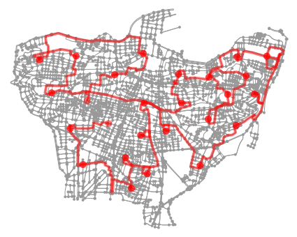

<h1>Optimal-Bus-Route-for-Beirut</h1>
<h1>  </h1>
<h1> Running the script</h1>
If you have conda setup then proceed with the remainder of this section.
 
If you do not have conda you can install it <a href = "https://docs.conda.io/projects/conda/en/latest/user-guide/install/">here</a>
 
`conda create --name <env> --file requirements.txt`.  
This will create a new conda environment with name you gave it and install the requirments we used.
 
Next you need to activate the environment you just made so run: `conda activate <name>`.
 
After this run the main file: `python main.py`
